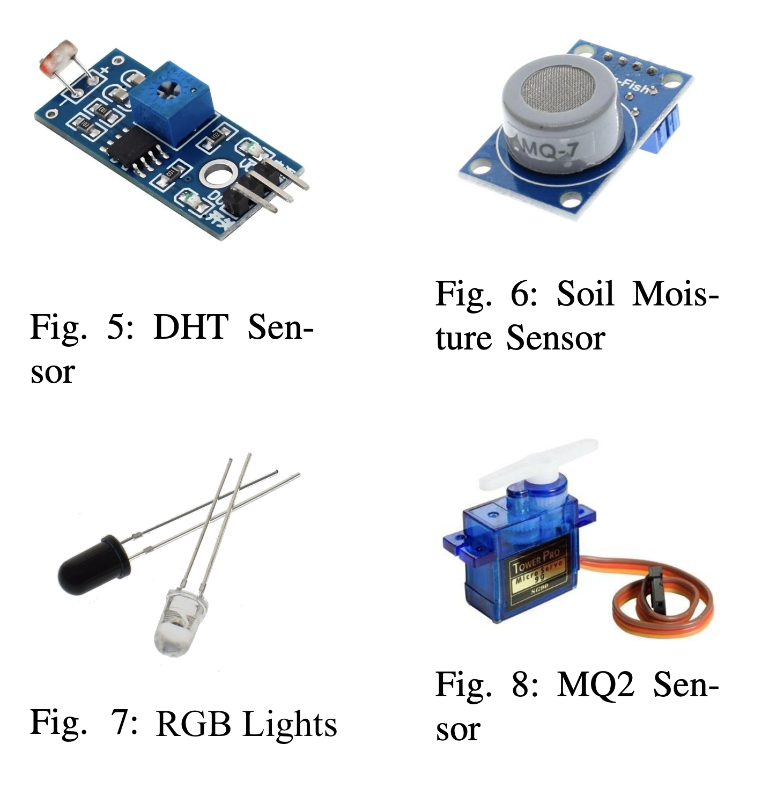

# Smart Farming using IoT

## Abstract

Traditional farming methods face mounting challenges, from climate volatility to resource scarcity. Our solution, leveraging the Internet of Things (IoT), addresses these pressing issues head-on. By integrating IoT devices and data analytics, our goal is to empower farmers to optimize resource usage, enhance productivity, and mitigate environmental impact. In an era marked by technological breakthroughs, agriculture stands as a frontier ripe for transformation. Our project, "Smart Farming using IoT," embodies this shift towards innovation. By harnessing the power of IoT, we aim to revolutionize traditional farming practices, ushering in a new era of efficiency, sustainability, and productivity.

## Introduction

Smart farming presents a comprehensive framework for increasing agricultural productivity through the integration of several sensors and IoT technologies. Real-time data capture and analysis are made possible by the deployment of sensors to monitor vital parameters like soil moisture, temperature, and nutrient levels, in conjunction with IoT connectivity. By utilizing actuators, one may optimize resource allocation, decrease manual involvement, and carry out automated tasks like fertilization and irrigation. Additionally, meteorological data is captured by environmental sensors, which makes predictive analytics possible for well-informed crop management decision-making. Through the use of mobile devices, the system architecture provides remote access to operational control and data insights, backed by cloud-based platforms. By using this strategy, the project hopes to promote sustainable agriculture practices by raising crop yields, preserving resources, and reducing risks.

Some of the elements used in this process were:

- **Arduino**: Serve as primary microcontroller platforms for sensor interfacing and data processing. They facilitate the collection of data from various sensors, such as ultrasonic sensors for measuring distance and detecting obstacles, DHT sensors for monitoring temperature and humidity levels, soil moisture sensors for assessing soil moisture content, gas sensors for detecting air quality parameters, and Light Dependent Resistors (LDR) for monitoring light intensity.
- **ESP8266 NodeMCU**: Enable wireless connectivity, allowing seamless communication with cloud-based platforms and remote monitoring capabilities. These boards enhance the system’s accessibility and scalability, empowering farmers to remotely access real-time insights into environmental conditions and make data-driven decisions to enhance agricultural productivity and sustainability.

## Hardware & Software Models

### Hardware Components

In our project, we utilized various hardware components to capture environmental data and facilitate sensor interfacing. Here’s a breakdown of the hardware components used:

- **DHT Sensor (DHT11)**: Measures temperature and humidity.
- **Soil Moisture Sensor**: Monitors soil moisture levels.
- **Ultrasonic Sensor**: Measures distance.
- **MQ-2 Smoke Sensor**: Detects smoke levels in the environment.
- **LDR Sensor**: Measures light intensity.
- **MQ-7 Carbon Monoxide (CO) Sensor**: Detects carbon monoxide levels in the environment.
- **LED Lights**: Integrated into the system for visual feedback or indication purposes. Three LEDs were utilized, each representing a different status or state (red, yellow, green).
- **Servo Motor**: Employed for motor control tasks in the system, controlling the movement of mechanical components.

### Circuit

### Software Tools

To facilitate data processing, communication, and control, we utilized several software tools and platforms:

- **Arduino IDE**: Used for programming the Arduino microcontroller. The IDE provides a simple and intuitive interface for writing and uploading code.
- **Flask Server**: Implemented to send the sensor data to a frontend application. Flask is a lightweight web application framework for Python, allowing us to create a RESTful API to communicate with the frontend.
- **Serial Communication**: Used for debugging and monitoring sensor readings during development via the Serial Monitor in the Arduino IDE.
- **Flutter Framework**: The frontend was developed using the Flutter framework, which is an open-source UI software development kit created by Google. Flutter allows for the development of cross-platform applications for mobile, web, and desktop from a single codebase.

## Implemented Algorithms

In our frontend code, we implemented various algorithms to process sensor data and generate alerts based on predefined conditions. These algorithms analyze the sensor readings obtained from the backend server and trigger appropriate actions or notifications. Here’s an overview of the implemented algorithms:

- **Soil Moisture Monitoring**: Constantly measures the moisture level in the soil. If the moisture falls below a predefined threshold, a sprinkler system is triggered to irrigate the soil and maintain optimal moisture levels.
- **Temperature and Moisture Alert**: Monitors both temperature and soil moisture levels simultaneously. If both values exceed predefined thresholds, a severe conditions alert is raised to notify farmers or users to take immediate action.
- **Humidity Alert**: Notifies users when humidity levels surpass a specified threshold, prompting them to take preventive measures to mitigate pest infestations and maintain crop health.
- **Gas Sensor Monitoring**: Continuously monitors the air for the presence of gases. If elevated gas levels are detected, a sprinkler system is activated to suppress potential flames and protect the farm from fire damage.
- **Ultrasonic Distance Monitoring**: Utilizes ultrasonic sensors to detect objects or intruders in close proximity to the farm. If objects are detected within a predefined range, an alert is triggered to notify users.
- **Light Level Monitoring**: Continuously monitors ambient light levels. If low light conditions are detected, the system automatically turns on farm lights to maintain visibility and security.

## Results

Our Smart Farming project yielded promising outcomes, as evidenced by the intuitive user interface designed to empower farmers with real-time insights and actionable data. The UI provides farmers with an intuitive dashboard where they can monitor crucial environmental parameters such as soil moisture, temperature, humidity, and gas levels at a glance. By leveraging interactive charts and visualizations, users can easily interpret complex data trends and make informed decisions to optimize crop management practices.

Furthermore, the UI incorporates alert mechanisms to notify users of any anomalies or critical events detected by the sensor network. Whether it’s detecting low soil moisture levels or high gas concentrations, our system ensures that farmers are promptly alerted to take corrective actions, thereby mitigating potential risks and maximizing crop yields.

Through extensive testing and refinement, our UI aims to streamline the farming workflow, enabling users to remotely control irrigation systems, monitor crop health, and manage resources efficiently. By providing farmers with a user-friendly interface powered by cutting-edge IoT technologies, our project paves the way for a more sustainable and productive future in agriculture.

## Conclusion

In conclusion, our smart farming project demonstrates how IoT technologies and sensor networks may be integrated to transform agricultural methods. Through the use of a wide range of sensors, including gas, ultrasonic, DHT, soil moisture, and LDRs, in conjunction with Arduino and ESP8266 NodeMCU development boards, we have developed a reliable system for the monitoring and control of environmental conditions in agricultural environments in real time. By using cloud-based technologies, farmers may benefit from even greater accessibility and scalability as well as actionable insights that help them maximize resource use and increase crop yield. Through this initiative, we hope to contribute to the transformation of traditional farming practices into ones that are more resilient and sustainable due to data-driven decision-making.

---

